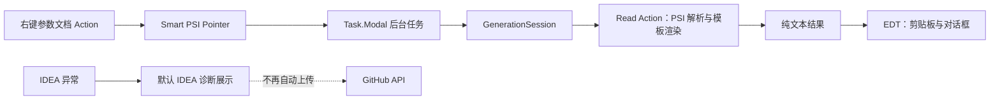

<!-- PDLC-TRACE -->
<!-- 功能ID: F20260804-135320 -->
<!-- 功能名称: p0-security-threading-hardening -->
<!-- 阶段: design -->
<!-- 前置文档: docs/01_requirements/prd/F20260804-135320-p0-security-threading-hardening-prd.md -->
<!-- 创建时间: 2026-08-04T13:55:02+08:00 -->
<!-- 关系: depends_on=B20260803-203714,B20260803-205116 -->

# P0 安全与请求参数生成线程加固设计

## 1. 概述

本设计只处理两个已确认的 P0：插件内置 GitHub 写入凭据与请求参数文档生成绕过统一后台会话。实现复用现有 IDEA Action、`GenerationSession`、Read Action 和通知能力，不引入服务端、账户体系、密码输入界面或第三方依赖。

## 2. 现状与目标架构

目标边界如下：

| 责任 | 目标实现 | 禁止行为 |
|------|----------|----------|
| 诊断上报 | 使用 IDEA 默认诊断展示；用户在浏览器中自主反馈 | 内置凭据、自动 GitHub HTTP 请求、上传 JVM 系统属性 |
| 参数文档计算 | 后台 `Task.Modal` 内的 `GenerationSession` 与 Read Action | 在 Action 调用线程执行深度 PSI 解析 |
| 结果呈现 | 后台任务结束后更新剪贴板与对话框 | 在 Read Action 或后台线程操作 Swing/剪贴板 |
| 会话状态 | `GenerationSession.close()` 统一清理 | 参数生成绕过配置初始化或 ThreadLocal 清理 |

## 3. 诊断安全设计

### 3.1 组件变更

1. 从 `META-INF/plugin.xml` 移除自定义 `errorHandler` 扩展。
2. 删除只为自动 GitHub Issue 上报服务的 `SaviorIssueSubmitter`、`AbstractGithubErrorReportSubmitter` 与 `AbstractErrorReportSubmitter`，从发行物中移除内置凭据及远端上报逻辑。
3. 调整 `ExceptionUtil` 的提示文案：保留本地错误信息，不再引导用户点击自动上报；可提示用户前往公开仓库自行反馈。

### 3.2 数据与异常处理

- 不再构造远端诊断载荷，因此不读取 `System.getProperties()`、用户补充信息或异常详情用于网络发送。
- 不再保留可写入 GitHub 的插件内置认证信息；已发布版本的凭据轮换属于仓库管理员的上线前人工事项。
- 远端网络失败不再影响插件 Action，因为 P0 实现不发起诊断 HTTP 请求。

### 3.3 明确不做

- 不新增自建诊断后端。
- 不要求用户填写 GitHub Token，也不将 Token 保存到项目配置。
- 不尝试以 Base64、加密或混淆方式“隐藏”凭据；客户端插件中的可用凭据均视为不安全。

## 4. 请求参数生成设计

### 4.1 调用链

`AbstractReqDocerSavior.handlePsiClass` 继续负责参数文档的领域计算，但不再直接执行。它通过 `SmartPsiElementPointer<PsiClass>` 委托给 `AbstractOnRightClickSavior` 的可复用后台生成编排：

1. 在 Action 线程仅取得当前文件和 Smart Pointer。
2. 启动已有的可取消 `Task.Modal`。
3. 任务中打开 `GenerationSession(project, currentFile)`，加载当前 content root 的配置。
4. 在 Read Action 内解析 `PsiClassType`、结构、示例、字段层级并渲染 FreeMarker。
5. 仅返回不含 PSI 的两个字符串：示例文本与参数说明 Markdown。
6. 任务成功返回后，在 UI 线程复制示例并显示 Markdown；取消、PSI 失效和异常不更新 UI。

### 4.2 最小数据模型

不引入新的通用生成框架或导出器层。参数文档路径使用项目已有的 `Pair<String, String>` 表示结果：

| 字段 | 类型 | 说明 |
|------|------|------|
| left | `String` | 复制到剪贴板的 JSON 或 Postman Bulk 示例 |
| right | `String` | 传入现有对话框的参数说明 Markdown |

该结果在离开 Read Action 前完成构建，后续不持有 `PsiClass`、`PsiType`、`Project` 或其他 PSI 对象。

### 4.3 抽象调整

- 将 `AbstractOnRightClickSavior` 中仅支持 `Supplier<String>` 的后台执行器扩展为受保护的泛型结果执行方法；原接口文档生成仍以 `String` 调用该方法，外部行为不变。
- `AbstractReqDocerSavior` 复用该执行器，并提供纯计算方法：输入当前 `PsiClass` 与 `Project`，输出 `Pair<String, String>`。
- 主题、`Java2MapReader`、`Java2BulkReader` 与 `Java2ApiReader` 继续复用，不移动其职责。

## 5. 兼容性与错误处理

| 场景 | 处理方式 |
|------|----------|
| 用户取消 | `ProcessCanceledException` 原样抛回 IDEA；不复制或弹窗。 |
| PSI 已失效 | 返回受控错误，经现有本地错误通知展示；不访问失效对象。 |
| 无配置文件 | 沿用 `PluginSettingHelper` 默认值；`GenerationSession` 仍清理状态。 |
| REST/RPC 主题 | 保持现有示例格式与 FreeMarker 模板选择规则。 |
| IDEA 2021.1.1 与当前版本 | 只使用项目已有平台 API 和 Java 11 语言级别。 |

## 6. 测试设计与验收

### 6.1 测试先行范围

| 测试 | 初始预期 | 修复后预期 |
|------|----------|------------|
| 插件描述符安全测试 | 自定义 `errorHandler` 与 Issue 上报类仍被声明，测试失败 | 不再声明，测试通过。 |
| 诊断源码/发行物检查 | 存在 GitHub 写入凭据或自动诊断 HTTP 路径，测试失败 | 发行物不含该实现与凭据，测试通过。 |
| 参数生成后台编排测试 | 请求参数 Action 无法使用通用后台结果执行器，测试失败 | 计算逻辑位于 Read Action，呈现回调只消费纯文本结果。 |
| 配置会话测试 | 参数生成入口未调用会话初始化，测试失败 | 当前文件配置在计算前可用，并在结束后清理。 |

### 6.2 手工 IDEA 验收

1. 在 IDEA 2021.1.1 与目标当前 IDEA 安装 ZIP。
2. 对含嵌套 DTO 的普通 Java Bean 分别执行 REST/RPC 参数文档 Action；确认界面可取消、示例复制和 Markdown 内容正确。
3. 在多模块项目为不同模块配置不同字段模板；确认参数文档选择当前模块配置。
4. 触发一个测试性插件错误；确认不存在自动 GitHub Issue 创建或网络上报提示。

## 7. 自审记录

- 审查时间：2026-08-04T13:55:02+08:00
- 对照 PRD：`docs/01_requirements/prd/F20260804-135320-p0-security-threading-hardening-prd.md`
- 发现问题：1 项（项目没有 `docs/00_standards/` 规范目录）。
- 自动修复：0 项。
- 待补充：可执行实现阶段应考虑使用 `/pdlc-standard add coding/java-plugin` 固化 IDEA 平台线程与敏感信息规范；本次不扩展范围。
