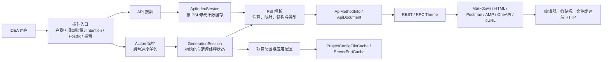

<!-- artifact_type: surface -->
<!-- PDLC-TRACE -->
<!-- 功能名称: 架构总览 -->
<!-- 阶段: design -->
<!-- 创建时间: 2026-08-04T12:28:07+08:00 -->

# 系统架构总览

> **surface 型产物**：描述项目当前架构；后续由 `/pdlc-arch` 就地覆盖更新，演进历史见 `git log docs/ARCHITECTURE.md`。

## 1. 系统全景

Api Savior 是运行在 IntelliJ IDEA 进程内的 Java 插件，不包含独立的前端、后端、数据库或消息队列。生产字节码为 Java 11，Gradle 插件以 IDEA 2021.1.1 为构建基线，`plugin.xml` 声明兼容范围为 `211.6693.111` 至 `263.*`。

## 2. 模块职责与边界

| 模块 | 职责 | 数据归属 | 对外接口 |
|------|------|----------|----------|
| `common.base.action` | 统一 Action 生命周期、后台任务、取消和异常边界 | IDEA `Project`、当前 PSI 上下文 | IDEA Action System |
| `common.context` | 建立并关闭一次生成任务的线程范围状态 | 当前生成线程 | `GenerationSession` |
| `common.resolver` | 从 PSI 提取注释、请求映射、参数/返回结构 | 瞬态 PSI 解析结果 | `RequestMappingResolver`、注释与结构解析器 |
| `savior.savior` / `reader` | 组织 API 语义、示例数据和格式导出 | `ApiMethodInfo`、`ApiDocument` | Markdown、Postman、AMP、OneAPI、cURL 导出器 |
| `savior.theme` | REST/RPC 差异和 FreeMarker 模板选择 | 主题配置与文档补充字段 | `Theme` |
| `search` | 扫描 Spring Controller 并提供 URL 导航 | 项目级、可失效搜索快照 | Search Everywhere / Go To Action |
| `common.util` | 配置、端口、文件、JSON/YAML、IDE 平台适配 | 项目级缓存与受控线程状态 | 项目配置和应用配置读取 |

当前抽象边界为：PSI 只在解析与主题补充阶段使用；模板渲染以无 PSI 的 `ApiDocument` 为根对象；文件、剪贴板和 HTTP 输出在解析完成后执行。`GenerationSession` 是 ThreadLocal 清理的唯一编排入口，避免一次生成遗留到线程复用后的下一次任务。

## 3. 通信机制

- 主要通信是 IDEA Platform API 调用：Action 在 UI 线程发起，耗时生成任务在进度线程执行；访问 PSI、索引和虚拟文件时必须受 Read Action 保护。
- API 搜索通过 IDEA 索引定位 `Controller` / `RestController`，再由 `RequestMappingResolver` 统一解析类和方法映射；`ApiIndexService` 以 PSI 修改计数失效快照。
- 文档生成在进程内同步完成；OneAPI 等外部导出仅在模型生成后通过 HTTP 发起，不把网络调用放入 PSI 读路径。
- 不存在服务间 API 版本、分布式事务或消息一致性问题；模板与导出格式的向后兼容由单元测试和安装包手工验证保障。

## 4. 数据架构

- 无持久化数据库。主要输入为 IDEA PSI、项目配置文件和 `application*.yml` / `application*.properties`；输出为编辑器内容、剪贴板、文件或远端 HTTP 请求。
- 配置文件与端口缓存均为 `Project` 服务，并以 content root 分区，适配多模块项目；PSI 修改后自动失效，插件销毁时释放。
- YAML 读取使用 Jackson YAML 模块；该模块及 SnakeYAML 被显式声明并通过 `verifyPluginRuntimeLibraries` 验证已打入插件 ZIP，避免依赖某个 IDEA 版本的内置库。
- `ApiMethodInfo` 传递解析语义，`ApiDocument` 传递模板数据；两者均为任务内瞬态对象，不跨项目保存。

## 5. 可观测性与故障处理

- 用户可见错误通过通知组反馈，异常经统一工具记录；取消异常会向 IDEA 平台继续传播，避免被误报为插件错误。
- 批量导出使用进度任务并在失败时回滚暂存输出，降低部分文件写入的风险。
- 这是本地插件，没有 RED 指标、集中日志或链路追踪。当前可验证信号是 Gradle 单元测试、运行时依赖打包校验、生成 ZIP，以及在支持的 IDEA 版本中手工执行受影响 Action。

## 6. 可扩展性

- 运行单位是单个 IDEA 项目，扩展方式不是横向扩容，而是减少 UI 阻塞、缩小 PSI 读区间并复用可失效的项目级快照。
- 批量文档生成统一经过 Action 编排和 `GenerationSession`，新导出格式应复用 `AbstractSavior`、`Theme` 和已有输出路径，而不是新增平行的 PSI 扫描流程。
- 当前 API 搜索会扫描项目范围内的 Spring Controller；大型项目的主要容量风险是索引扫描与全量导出时间，而非网络或存储吞吐。

## 7. 架构评分

| 维度 | 评分 (1-5) | 依据 |
|------|-----------|------|
| 服务拆分合理性 | 4 | 单插件按入口、解析、模型、主题、输出和搜索分层；少数导出器仍共享较宽的 `AbstractSavior` 基类。 |
| 通信机制 | 4 | UI、后台、Read Action 与外部 HTTP 已有明确边界；IDE API 兼容范围需持续回归验证。 |
| 数据架构 | 4 | 没有持久化状态，项目级缓存按 content root 和 PSI 修改计数失效；配置发现仍依赖文件名扫描。 |
| 可观测性 | 3 | 有通知、异常记录、构建与打包校验；缺少结构化诊断、性能计时和自动化 IDE 集成测试。 |
| 可扩展性 | 4 | 项目级缓存、后台批量任务和模型化模板数据已降低重复工作；超大项目尚无分页或增量导出策略。 |

## 8. 问题清单与改进建议

| 优先级 | 问题 | 建议 |
|--------|------|------|
| P1 | `Theme` 与部分导出回调仍直接接收 PSI，模型与 IDEA 平台未完全解耦。 | 仅在出现第三种文档输出或需要脱离 IDEA 复用时，再将主题补充所需字段并入不可变模型；当前不做额外抽象。 |
| P1 | API 搜索与映射解析主要依赖 IDEA 索引，缺少真实 IDE 自动化回归。 | 为典型 Spring 多模块样例建立手工验证清单；升级 IDEA 基线时安装 ZIP 验证搜索与生成 Action。 |
| P2 | 运行期错误只能依靠通知和日志定位，无法快速判断慢路径。 | 在批量扫描、模板渲染和远端 HTTP 失败点补充耗时与上下文日志，注意脱敏。 |
| P2 | 配置与端口缓存基于全局 PSI 修改计数，任意 PSI 修改都可能导致重新读取。 | 只有在大型项目中确认该失效频率造成可见延迟时，再改为配置文件级别的修改追踪。 |

---

> 与具体变更相关的设计记录见 `docs/02_design/`；本文件只维护系统当前结构。
